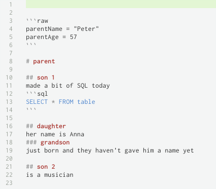

# Full scale usage

Simple example with all syntactical constructs first, not a typical usage, just to show what can be done (a screenshot, 
nested fenced code blocks are a bit tricky to say at least).



And now it is better just to write how to use it

```go
package main

import (
	"github.com/sirkon/mad"
	"fmt"
)	

func function(input []byte) (ef ExtendedFamily, err error) {
	err = mad.Unmarshal(input, &ef, mad.NewContext())
	return
}

// Extended family starts with the man named Peter, 57 y.o.
type ExtendedFamily struct {
	ParentName string `mad:"parentName"`
	ParentAge  uint   `mad:"parentAge"`
	Parent     struct {
		Sons     Sons `mad:"son\s\d+"`  // All headers looking like `son 123` are matched against Sons field
		Daughter struct {
			Grandson mad.Comment `mad:"grandson"`
		} `mad:"daughter"`
	} `mad:"parent"`
}

// Sons are stored in this map
type Sons map[string]SonInfo

// Decode to implement mad.Sufficient
func (s Sons) Decode(dest interface{}, header mad.String, d *mad.Decoder, ctx mad.Context) (mad.Sufficient, error) {
	// check what the dest is and initialize it if needed
	v, ok := dest.(Sons)
	if !ok {
		return nil, fmt.Errorf("dest must be %T, got %T", s, dest)
	}
	if v == nil {
		v = Sons{}
	}

	// check if exactly this son has not been filled before
	if _, ok := v[header.Value]; ok {
		return nil, mad.LocatedError{
			Lin: header.Lin,
			Col: header.Col,
			Err: fmt.Errorf("duplicate sone ID `%s`", header.Value),
		}
	}

	// decode son information
	sonInfo := SonInfo{}
	if err := d.Decode(&sonInfo, ctx.New()); err != nil {
		return nil, err
	}
	v[header.Value] = sonInfo

	// return created object
	return v, nil
}

// Require to implement mad.Sufficient
func (s Sons) Required() bool {
	return false
}

// testing README.md sample
type SonInfo struct {
	Info mad.Comment
	Code *mad.Code
}

// Decode to implement mad.Decodable
func (s *SonInfo) Decode(d *mad.Decoder, ctx mad.Context) error {
	newctx := ctx.New()
	newctx.Set("syntax", "sql") // only sql syntax is allowed

	// consume Info (comment) first
	if err := d.Decode(&s.Info, ctx); err != nil {
		return err
	}

	// consume Code if is there (pointer of pointer of something means it is not mandatory)
	s.Code = &mad.Code{}
	_ = d.Decode(&s.Code, ctx)
	return nil
}
```

# What's left
We didn't cover how to use `mad.Unmarshaler`. This is easy though, just like with `json.Unmarshaler`. It is a minor 
feature and can only be used for a data definited in raw fenced code blocks.