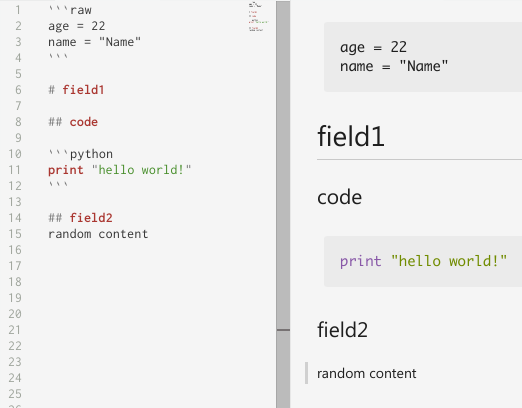

# mad
[](https://travis-ci.org/sirkon/mad)

This is a literate configuration format library for Go inspired by Markdown. 

Installation:

* the prefered way is via the dep
    ```
    dep ensure -add github.com/sirkon/mad    
    ```
* using go get is not recommended, but still should work
    ```
    go get github.com/sirkon/mad
    ```

Read about typical usecases [here](USECASES.md). 
In short, ___mad___ library is useful in cases where pieces of structured data or code are needed and there's not much
nesting in data. Think about SQLs here at first.

## Simplest usage

Take a look at short example:



Now about what consumes this and how:

```go
package main

import (
	"github.com/sirkon/mad"
	"os"
	"io/ioutil"
	"strings"
)

func main() {
	input := []byte("```raw\nage = 22\nname = \"Name\"\n```\n\n# field1\n## code\n```python\n```\n\n## field2\nrandom content")
	var dest struct {
		Name   string `mad:"name"`
		Age    int    `mad:"age"`
		Field1 struct {
			Code   mad.Code    `mad:"code,syntax=python"`
			Field2 mad.Comment `mad:"field2"`
		} `mad:"field1"`
	}
	if err := mad.Unmarshal(input, &dest, mad.NewContext()); err != nil {
		panic(err)
	}
}
```

Here:
* fenced code block with `raw` syntax is used to deliver scalar values. Integers, floating points, strings and
boolean values are supported
* you need `mad.Code` type to consume code block
* you need `mad.Comment` type to consume comment block
* comments (everything, that is not header or fenced code block) are normally ignored (this is a bug if they aren't) 
    except the case where you are using `mad.Comment` 


This simple example is not different from what you can used to with stdlib JSON package (except may be only
fields tagged with `mad:".."` can be filled by Decoder). But this is human oriented format and that's why special
interfaces were introduced:
* It is possible to control fragment order in Markdown files (define your `mad.Decodable` type and write down desired decoding order manually)
* It is possible to use header as a source of information, fulfilling fields with data from header text (define your `mad.Sufficient` type)
* It is possible to reimplement how scalar types are treated (define your own `mad.Unmarshaler` type)
* It is possible to match by regexp, not just by fixed name. Usually `mad .Sufficient` is used in these cases as a field value type
* It is possible to match against several syntax types, for instance, use `syntax=python perl` to match against perl or python fenced code block

see at the harder example [here](HARD.md)
