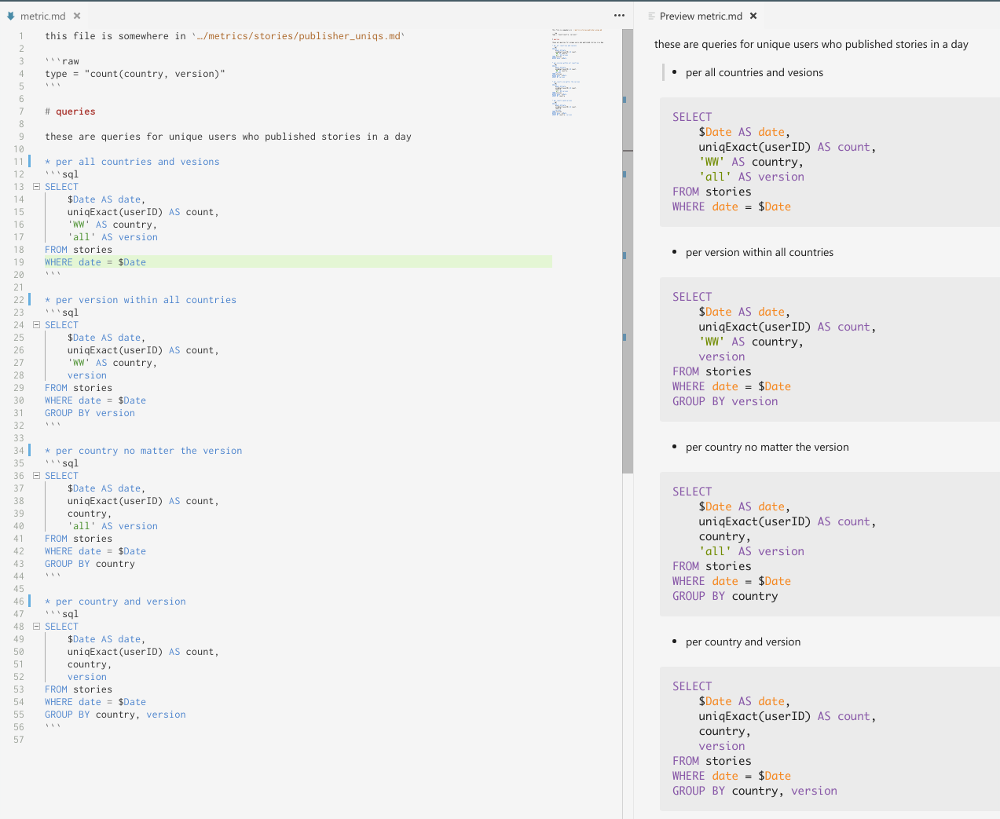

# Usecase 1.

Consider computation statitical systems based on storage with SQL interface, such as [Clickhouse](https://clickhouse.yandex), 
[Vertica](https://vertica.com), etc. 

Typically, you have a lot of queries computing values for these metrics, this leads to a lot of SQL. 
At my previous job (2015-2017) we have a tree of metrics like `<period>.<product name>.<feature>.<metric name>` (each metric can have several queries).
For instance `daily.chat.story.uniq_creators` which had a queury to compute amount of uniq users who created a story through
a given date. We ended by mapping this name into a file system path: `${METRIC_DIR}/daily/chat/story/uniq_creators.md`
where the file itself was a piece of YAML which had a tendency to become unreadable at times. 
YAML editing modes don't have an idea of code blocks. Markdown editors are perfectly aware of them.
For us it would look like (VSCode on Ubuntu 17.10)




This piece can be consumed with a code like that

```go
…
input, err := ioutil.ReadFile("daily/story/uniq_creators.md")
if err != nil {
	return err
}
var metric struct {
	Type string `mad:"type"`
	Queries []mad.Source `mad:"queries,syntax=sql"`
}
if err := mad.Unmarshal(input, &metric, mad.NewContext()); err != nil {
	return err
}
…
``` 

# Usecase 2
At the current job we are building documentation system for our GRPC services from enforced comments. We needed examples 
and it turned to be these better be put alongside proto files declaration (`services.proto` with any service declaration within
must have connected `services.md` in the same directory). We ended up with examples written as extended JSONs where 
integer keys are allowed, so these may not be valid JSONs and YAMLs and we can't just use JSON schema to validate them.
Also, we need 
* Locate error position when it doesn't pass validation. Remember we can have numerous samples in one file and thus 
we should take the position of the validated piece into account to give positional information of an error.
* We should be much stricter than YAML and JSON parsers available and will not pass unused sections as they are not
represented in destination object (via `mad` tags). Also, some fields may be required and we should not pass them 
untouched.
* Return compilation-like errors `<file name>:<line>:<column>: <message>` as these are rather the part of code than
an average Joe's configs.  

How it looks like (VSCode on Ubuntu 17.10. This doesn't mean I recommend using it – I actually prefer GoLand as it can
fold header contents, VSCode just looks the best in my opinion)


See `Status(ERROR, UNKNOWN_SOMETHING, ETC)` header? The ___mad___ doesn't only support JSON or YAML-like unmarshal,
but also can match suitable sections with regular expression and process them once matched field's type implements a
special interface.

 